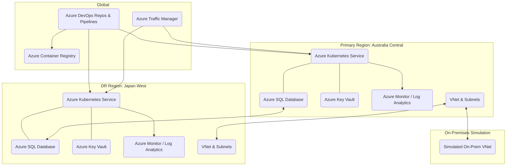

# Capstone-Infra: Azure DevOps Cloud Capstone Project Infrastructure

This repository contains the Infrastructure as Code (IaC) definitions for the Azure DevOps and Cloud Capstone Project. The goal of this project is to design, implement, and manage a complete end-to-end DevOps lifecycle in a real-world Azure cloud environment, focusing on high availability, disaster recovery, security, and automated deployments.

The infrastructure defined here supports a microservices-based application deployed on Azure Kubernetes Service (AKS) across multiple regions.

## 🌟 Project Goal

The primary goal of this repository is to provision a secure, scalable, and resilient Azure cloud infrastructure that serves as the foundation for the microservices application developed within the broader Capstone Project. This includes configuring networking, compute, databases, security services, and monitoring capabilities using Terraform.


## ✨ Key Features & Components

This infrastructure project provisions and configures the following key Azure components:

### Multi-Region Deployment:
- **Primary Region**: Australia Central
- **Disaster Recovery (DR) Region**: Japan West
- **Container Orchestration**: Two Azure Kubernetes Service (AKS) clusters (Active-Passive DR model).
- **Container Registry**: Azure Container Registry (ACR) with geo-replication for efficient image distribution.

### Networking:
- Virtual Networks (VNets) with public and private subnets.
- Azure NAT Gateway for outbound connectivity from private subnets.
- Azure Bastion Host for secure administrative access.
- VNet Peering between regions.
- Simulated On-Premises VNet with Site-to-Site VPN configuration.

### Database:
- Azure SQL Database (configured for geo-replication with the application backend).

### Secrets Management:
- Azure Key Vault for secure storage and management of application secrets.

### Monitoring & Logging:
- Azure Monitor / Log Analytics Workspaces for centralized logging and metrics.
- Configuration for Application Insights integration.

### Identity & Access Management (IAM):
- Azure Budget creation.
- Definition and assignment of custom user roles with granular access (Owner, Contributor, Reader) at various scopes.

### Security & Compliance:
- Network Security Group (NSG) rules for minimal port exposure.
- Azure Policy definitions (e.g., for image scan enforcement).

## 🏛️ High-Level Architecture

The infrastructure is designed for high availability and disaster recovery, with services distributed across two Azure regions. Azure Traffic Manager acts as a global DNS-based router, directing traffic to the active region.



## 🚀 Getting Started

To deploy this infrastructure, you will need the following prerequisites:

### Prerequisites
- An active Azure Subscription.
- Azure CLI installed and configured (`az login`).
- Terraform (v1.0+) installed.
- Git installed.
- An Azure DevOps Project set up to host your pipelines and source code.
- Appropriate Azure permissions to create and manage resources at the subscription level.

### Deployment Steps (Manual for testing, Automated via Azure Pipelines for Production)

While the recommended deployment method is via Azure Pipelines, you can test the Terraform configurations locally:

**Clone the repository:**
```bash
git clone https://github.com/pratheek08/Capstone-Infra.git
cd Capstone-Infra
```

**Authenticate with Azure CLI:**
```bash
az login
# Set your desired subscription if you have multiple
az account set --subscription "<your-subscription-id>"
```

**Initialize Terraform:** Navigate to the root of your Terraform configuration (e.g., environments/production or directly in the root if all configurations are there) and initialize Terraform.
```bash
# Example: If your main configurations are directly in the root
terraform init
```

**Plan the deployment:** Review the changes Terraform will apply.
```bash
terraform plan -out main.tfplan
```

**Apply the deployment:** Execute the planned changes to provision resources in Azure.
```bash
terraform apply "main.tfplan"
```

**Destroy the infrastructure (Optional):** To remove all provisioned resources.
```bash
terraform destroy
```

## Azure DevOps Pipelines Integration

This repository is designed to be deployed and managed via Azure Pipelines. The `pipelines/` directory will contain YAML definitions for the Infrastructure CD pipeline, which automatically applies Terraform changes upon code commits to the main branch or triggered releases.

## 📂 Repository Structure

The repository is organized to promote modularity and reusability:

```
.
├── modules/
│   ├── aks/                     # Terraform module for AKS cluster
│   ├── networking/              # Terraform module for VNet, subnets, NAT Gateway, Bastion
│   └── ...                      # Other reusable modules (e.g., sql_database, key_vault)
├── environments/
│   ├── dev/                     # Environment-specific configurations (if applicable)
│   ├── prod/                    # Environment-specific configurations (if applicable)
│   └── global/                  # Global resources (e.g., Traffic Manager)
├── pipelines/
│   ├── infra-ci.yml             # CI pipeline for Terraform code (linting, validation)
│   └── infra-cd.yml             # CD pipeline for applying Terraform
├── scripts/                     # Helper scripts (e.g., for pre-commit hooks, validation)
├── .github/                     # GitHub specific configurations (e.g., workflows, templates)
├── .terraformignore             # Files to ignore during Terraform operations
├── main.tf                      # Main Terraform configuration (or in environments/)
├── variables.tf                 # Variable definitions
├── outputs.tf                   # Output definitions
├── README.md                    # This file
└── ...
```

> (Note: The exact structure might evolve based on project needs.)

## 🔒 Security & Compliance Notes

- **Azure Key Vault**: All sensitive information (e.g., database connection strings, API keys) is managed through Azure Key Vault and injected securely into application components (e.g., AKS pods).
- **Network Security Groups (NSGs)**: NSGs are strictly configured to open only the minimum required ports for communication.
- **Azure Policy**: Relevant Azure Policies are enforced to ensure compliance (e.g., requiring specific resource tags, enforcing image scanning).

## 📊 Monitoring

The infrastructure integrates with Azure Monitor and Log Analytics to provide comprehensive observability:

- **Application Insights**: For application-level logging, custom metrics, and dependency tracking.
- **Container Insights (for AKS)**: For monitoring AKS cluster performance and container health.
- **Resource-specific Diagnostics**: Configured to send logs and metrics from all Azure resources to a centralized Log Analytics Workspace.

## 🤝 Contributing

Contributions are welcome! If you find issues or have suggestions for improvements, please open an issue or submit a pull request.
